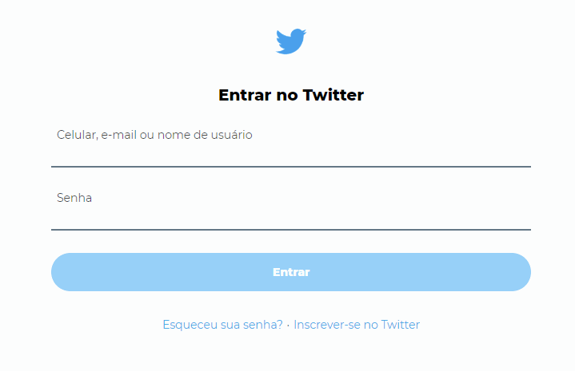

# Recriando a tela de login do Twiter

Projeto integrante do curso de Programação Front-end Estação Hack from Facebook, realizado pela Digital House

O objetivo do projeto é recriar a página de login do Twitter

O deploy do projeto foi feito na Netlify e o resultado final pode ser conferido [clicando aqui](https://twitter-login-clone.netlify.app/)

# Tecnologias utilizadas:
:small_orange_diamond: HTML5

:small_blue_diamond: CSS3

# Status: Finalizado :heavy_check_mark:
